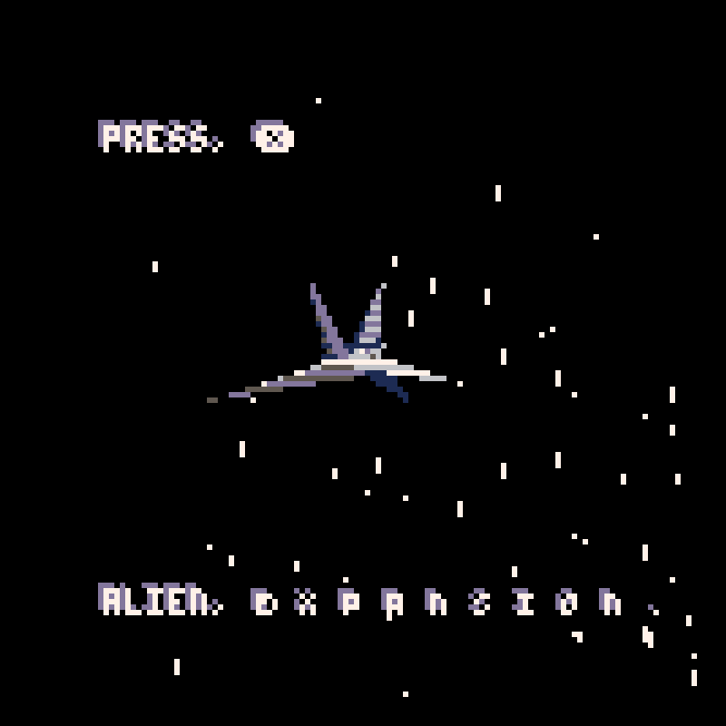

# ALIEN, e x p a n s i o n .

Small game created in under 48 hours for [Ludum Dare 44](https://ldjam.com/events/ludum-dare/44) with the theme of **Your life is currency**.

Game is built using [Lua](https://www.lua.org/) and [MoonScript](https://moonscript.org/), with the [PICO-8](https://www.lexaloffle.com/pico-8.php) Fantasy Console.

Entered as a [Ludum Dare 44](https://ldjam.com/events/ludum-dare/44) **compo** game.

**[Ludum Dare Page](https://ldjam.com/events/ludum-dare/44/alien-e-x-p-a-n-s-i-o-n)**

**[Play Updated Game](https://jaxs.onl/projects/ludum-dare-44/play/)**

**[Play Original Version](https://jaxs.onl/ludum-dare-44/)** entered in [Ludum Dare 44](https://ldjam.com/events/ludum-dare/44)

**[Lexaloffle BBS Page](https://www.lexaloffle.com/bbs/?tid=34861)**

## Instructions

Play as an alien bounty hunter attempting to amass a small fortune by capturing human manned ships using a state-of-the-art vortex laser.

You will be payed by some of the galaxies top scientists who aim to study these humans.

Be careful as hitting human ships will deplete your life meter and more importantly will lead to unwarranted attention and hence will detract from your score/pay.

However capturing a human will restore a small amount of life and the increase your score.  Additionally flying past human ships will also add to your score.

Capture as many ships as possible to achieve a high payday and satisfy the scientists.

## Controls

-   **Arrows Keys** - Control your ship
-   **X Key** - Fire vortex laser / Advance menus
-   **Z Key** - Change camera settings (menu)

## Building

This project uses [p8](https://github.com/jozanza/p8) to structure its source files.

Additionally `luamin` to reduce the total [PICO-8](https://www.lexaloffle.com/pico-8.php) compressed cartridge size.

In order to build a `.p8` file simply install `p8` and `luamin` using `npm install -g p8 luamin` .

Then build with `./build.sh` in the root of the project foler.  This will generate a `alien-expansion.p8` file.

## Screenshots

